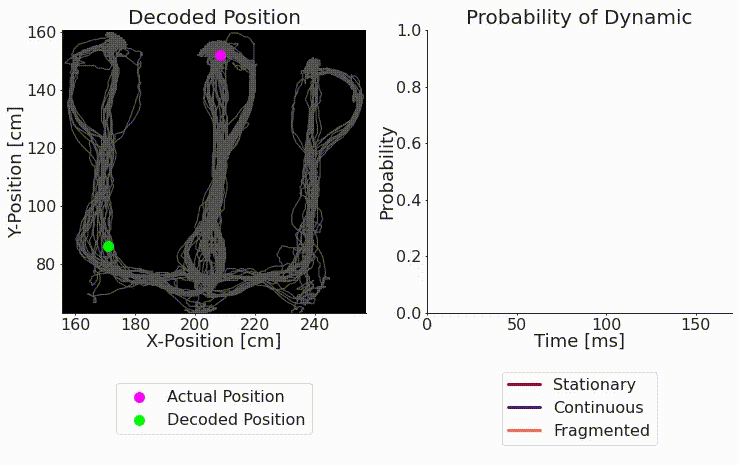

# replay_trajectory_classification

[](https://zenodo.org/badge/latestdoi/177004334)

[](https://mybinder.org/v2/gh/Eden-Kramer-Lab/replay_trajectory_classification/master)
[](https://github.com/Eden-Kramer-Lab/replay_trajectory_classification/actions/workflows/PR-test.yml)

[**Installation**](#installation)
| [**Documentation**](#documentation)
| [**Tutorials**](#tutorials)
| [**References**](#references)
| [**Developer Installation**](#developer-installation)

## What is replay_trajectory_classification?

`replay_trajectory_classification` is a python package for decoding spatial position represented by neural activity and categorizing the type of trajectory.

<p align="center">
  </img>
</p>

### Advantages over other algorithms

It has several advantages over decoders typically used to characterize hippocampal data:

1. It allows for moment-by-moment estimation of position using small temporal time bins which allow for rapid movement of neural position and makes fewer assumptions about what downstream cells can integrate.
2. The decoded trajectories can change direction and are not restricted to constant velocity trajectories.
3. The decoder can use spikes from spike-sorted cells or use clusterless spikes and their associated waveform features to decode .
4. The decoder can categorize the type of neural trajectory and give an estimate of the confidence of the model in the type of trajectory.
5. Proper handling of complex 1D linearized environments
6. Ability to extract and decode 2D environments
7. Easily installable, documented code with tutorials on how to use the code (see below)
8. Fast computation using GPUs. (Note: must install `cupy` to use)

### References

For further details, please see our [eLife paper](https://doi.org/10.7554/eLife.64505):
> Denovellis, E.L., Gillespie, A.K., Coulter, M.E., Sosa, M., Chung, J.E., Eden, U.T., and Frank, L.M. (2021). Hippocampal replay of experience at real-world speeds. ELife 10, e64505.

or our [conference paper](https://doi.org/10.1109/IEEECONF44664.2019.9048688):
> Denovellis, E.L., Frank, L.M., and Eden, U.T. (2019). Characterizing hippocampal replay using hybrid point process state space models. In 2019 53rd Asilomar Conference on Signals, Systems, and Computers, (Pacific Grove, CA, USA: IEEE), pp. 245–249.

Also see other work using this code:
> Gillespie, A.K., Astudillo Maya, D.A., Denovellis, E.L., Liu, D.F., Kastner, D.B., Coulter, M.E., Roumis, D.K., Eden, U.T., and Frank, L.M. (2021). Hippocampal replay reflects specific past experiences rather than a plan for subsequent choice. Neuron S0896627321005730. <https://doi.org/10.1016/j.neuron.2021.07.029>.

> Joshi, A., Denovellis, E.L., Mankili, A., Meneksedag, Y., Davidson, T., Gillespie, K., Guidera, J.A., Roumis, D., and Frank, L.M. (2022). Dynamic Synchronization between Hippocampal Spatial Representations and the Stepping Rhythm. bioRxiv, 30. <https://doi.org/10.1101/2022.02.23.481357>.

> Gillespie, A.K., Astudillo Maya, D.A., Denovellis, E.L., Desse, S., and Frank, L.M. (2022). Neurofeedback training can modulate task-relevant memory replay in rats. bioRxiv, 2022.10.13.512183. <https://doi.org/10.1101/2022.10.13.512183>.

### Installation

`replay_trajectory_classification` can be installed through PyPI or conda. **Conda is strongly recommended** to ensure that all complex scientific dependencies are installed properly.

#### Recommended (Conda)
```bash
conda install -c edeno replay_trajectory_classification
```

#### Alternative (PyPI)
```bash
pip install replay_trajectory_classification
```

**Requirements**: Python 3.10+ with scientific computing stack (NumPy, SciPy, pandas, etc.)

### Documentation

Documentation can be found here: <https://replay-trajectory-classification.readthedocs.io/en/latest/>

### Tutorials

There are five jupyter notebooks introducing the package:

1. [01-Introduction_and_Data_Format](notebooks/tutorial/01-Introduction_and_Data_Format.ipynb): How to get your data in the correct format to use with the decoder.
2. [02-Decoding_with_Sorted_Spikes](notebooks/tutorial/02-Decoding_with_Sorted_Spikes.ipynb): How to decode using a single movement model using sorted spikes.
3. [03-Decoding_with_Clusterless_Spikes](notebooks/tutorial/03-Decoding_with_Clusterless_Spikes.ipynb): How to decode using a single movement model using the "clusterless" approach --- which does not require spike sorting.
4. [04-Classifying_with_Sorted_Spikes](notebooks/tutorial/04-Classifying_with_Sorted_Spikes.ipynb): Using multiple movement models to classify the movement dynamics and decode the trajectory using sorted spikes.
5. [05-Classifying_with_Clusterless_Spikes](notebooks/tutorial/05-Classifying_with_Clusterless_Spikes.ipynb): Using multiple movement models to classify the movement dynamics and decode the trajectory using clusterless spikes.

### Developer Installation

For people who want to expand upon the code for their own use:

#### Prerequisites

Install miniconda (or anaconda) if it isn't already installed:

```bash
# Linux/macOS
wget https://repo.continuum.io/miniconda/Miniconda3-latest-Linux-x86_64.sh -O miniconda.sh
bash miniconda.sh -b -p $HOME/miniconda
export PATH="$HOME/miniconda/bin:$PATH"
hash -r
```

#### Environment Setup

```bash
# Update conda
conda update -n base conda

# Create environment from environment.yml
conda env create -f environment.yml

# Activate environment
conda activate replay_trajectory_classification
```

#### Development Installation

```bash
# Modern development installation (recommended)
pip install -e .

# With optional development tools
pip install -e '.[dev]'      # Includes ruff, jupyter, testing tools
pip install -e '.[test]'     # Testing dependencies only
pip install -e '.[docs]'     # Documentation building tools
```

#### Verification

Test your installation:
```bash
python -c "import replay_trajectory_classification; print('✓ Installation successful')"
ruff check replay_trajectory_classification/  # Code quality check
```

#### Building Distribution Packages

```bash
pip install build
python -m build --wheel      # Creates wheel in dist/
python -m build --sdist      # Creates source distribution
```
