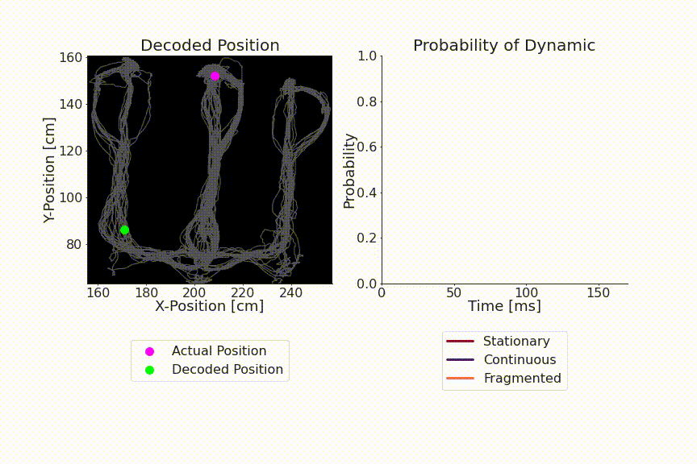

# replay_trajectory_classification
[](https://zenodo.org/badge/latestdoi/177004334)
[](https://mybinder.org/v2/gh/Eden-Kramer-Lab/replay_trajectory_classification/master)
[](https://github.com/Eden-Kramer-Lab/replay_trajectory_classification/actions/workflows/PR-test.yml)

`replay_trajectory_classification` is a python package for decoding spatial position represented by neural activity and categorizing the type of trajectory.

<p align="center">
  </img>
</p>

It has several advantages over decoders typically used to characterize hippocampal replay:
1. It allows for moment-by-moment estimation of position using small temporal time bins which allow for rapid movement of neural position and makes fewer assumptions about what downstream cells can integrate.
2. The decoded trajectories can change direction and are not restricted to constant velocity trajectories.
3. The decoder can use spikes from spike-sorted cells or use clusterless spikes and their associated waveform features to decode .
4. The decoder can categorize the type of neural trajectory and give an estimate of the confidence of the model in the type of trajectory.
5. Proper handling of complex 1D linearized environments
6. Ability to decode 2D position
7. Easily installable, documented code with tutorials on how to use the code (see below)

For further details, please see our [eLife paper](https://doi.org/10.7554/eLife.64505):
> Denovellis, E.L., Gillespie, A.K., Coulter, M.E., Sosa, M., Chung, J.E., Eden, U.T., and Frank, L.M. (2021). Hippocampal replay of experience at real-world speeds. ELife 10, e64505.

or our [conference paper](https://doi.org/10.1109/IEEECONF44664.2019.9048688):
> Denovellis, E.L., Frank, L.M., and Eden, U.T. (2019). Characterizing hippocampal replay using hybrid point process state space models. In 2019 53rd Asilomar Conference on Signals, Systems, and Computers, (Pacific Grove, CA, USA: IEEE), pp. 245–249.

### Installation ###

`replay_trajectory_classification` can be installed through pypi or conda. Conda is the best way to ensure that all the dependencies are installed properly.

```bash
pip install replay_trajectory_classification
```
Or

```bash
conda install -c edeno replay_trajectory_classification
```

### Tutorials ###
There are five jupyter notebooks introducing the package:

1. [01-Introduction_and_Data_Format](notebooks/tutorial/01-Introduction_and_Data_Format.ipynb): How to get your data in the correct format to use with the decoder.
2. [02-Decoding_with_Sorted_Spikes](notebooks/tutorial/02-Decoding_with_Sorted_Spikes.ipynb): How to decode using a single movement model using sorted spikes.
3. [03-Decoding_with_Clusterless_Spikes](notebooks/tutorial/03-Decoding_with_Clusterless_Spikes.ipynb): How to decode using a single movement model using the "clusterless" approach --- which does not require spike sorting.
4. [05-Classifying_with_Sorted_Spikes](notebooks/tutorial/04-Classifying_with_Sorted_Spikes.ipynb): Using multiple movement models to classify the movement dynamics and decode the trajectory using sorted spikes.
5. [05-Classifying_with_Clusterless_Spikes](notebooks/tutorial/05-Classifying_with_Clusterless_Spikes.ipynb): Using multiple movement models to classify the movement dynamics and decode the trajectory using clusterless spikes.

### Developer Installation ###
For people who want to expand upon the code for their own use:

1. Install miniconda (or anaconda) if it isn't already installed. Type into bash (or install from the anaconda website):
```bash
wget https://repo.continuum.io/miniconda/Miniconda3-latest-Linux-x86_64.sh -O miniconda.sh;
bash miniconda.sh -b -p $HOME/miniconda
export PATH="$HOME/miniconda/bin:$PATH"
hash -r
```

2. Go to the local repository on your computer (cd `.../replay_trajectory_classification`) and install the anaconda environment for the repository. Type into bash:
```bash
conda update -n base conda # make sure conda is up to date
conda env create -f environment.yml # create a conda environment
conda activate replay_trajectory_classification # activate conda environment
python setup.py develop
```
